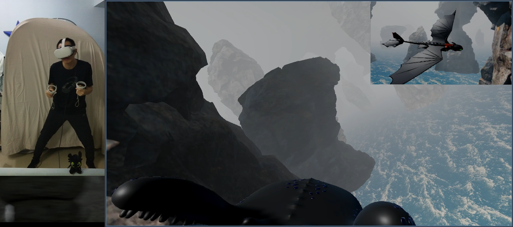
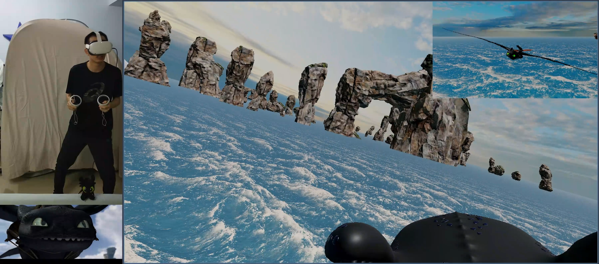
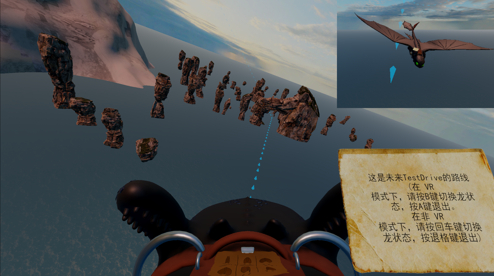
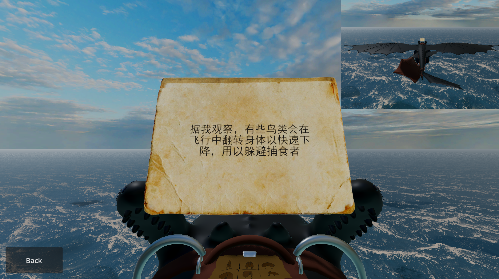
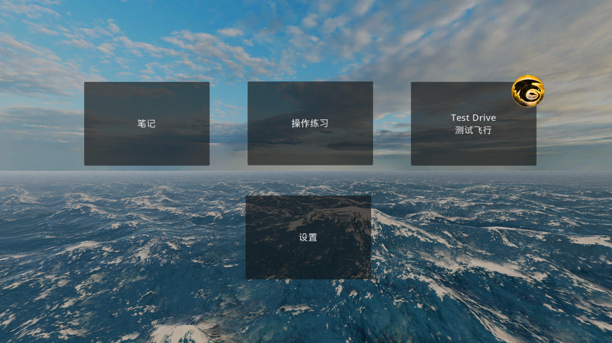
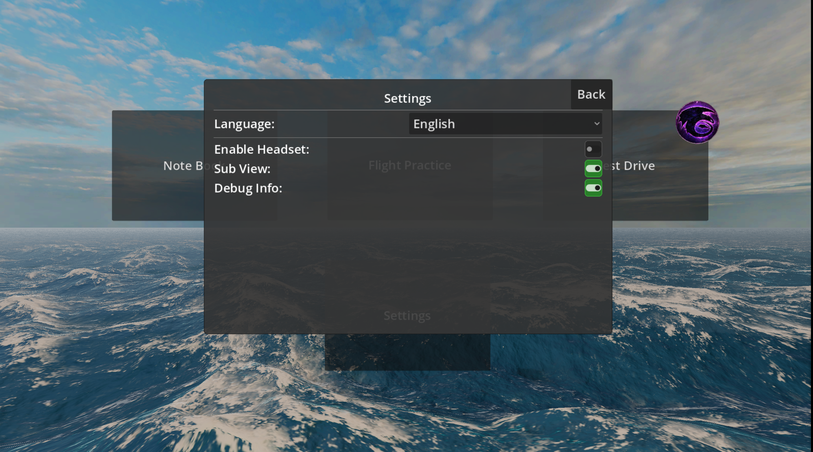
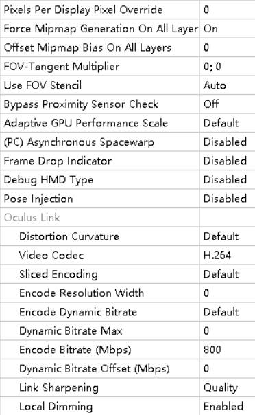

<p align="center"></p>
<div align="center">

English | [简体中文](Media/Docs/README_ZH.md)

# How to Train Your Dragon
VR dragon riding experience built with Godot 4.

This project is driven purely by personal interest. It is completely free, fully open-source, and will remain so in the future.

[](Media/Demo/Demo.mp4)

[](https://www.codefactor.io/repository/github/frosthex/httyd/overview/main)


# Table of Contents
</div>

- [Snapshots](#snapshots)
- [Project Introduction](#project-introduction)
- [Playing Recommendation](#playing-recommendation)
- [Development Guide](#development-guide)
- [Acknowledgements](#acknowledgements)
- [License & Third-Party Assets](#license--third-party-assets)

<div align="center">

## Snapshots <a id="snapshots"></a>
<p align="center">
  
  
</p>
<p align="center">
  
  
</p>
<p align="center">
  
  
</p>

## Project Introduction <a id="project-introduction"></a>
The player is Hiccup, the protagonist of the movie How to Train Your Dragon, and the story takes place a few days before he and his dragon partner Toothless test fly. Players need to memorize the control methods on their flight notes, familiarize themselves with the flight route, and do their best during the test flight, while also dealing with unexpected changes such as high-altitude stalling and falling, strong winds blowing the cheat sheet away that players need to catch in mid-air with their controllers, unexpected fog obscuring vision, etc. The VR device enhances the immersion and sense of presence for this journey, and all OpenXR-compatible VR headsets can play it normally. The game also has both Chinese and English languages. Due to poor iteration, the game play and the controls are far less than ideal for now, but there is a mid-term save mechanism that can increase fault tolerance. For the upper limit of operation, a small achievement system is set up: complete Test Drive to get a level 1 silver badge; remain calm in the face of changes and still complete Test Drive according to the predetermined route to get a level 2 gold badge; complete Test Drive according to the predetermined route without crashing or loading at all to get a level 3 purple badge.

## Playing Recommendation <a id="playing-recommendation"></a>
</div>

- **OpenXR**: Any environment that supports OpenXR should be able to run this project (such as Steam VR, Meta Quest Link, etc.). I tested it on Windows only.  
- **Vulkan**: Vulkan needs to be supported by the graphics card and driver.  
- **VR Mode**: VR mode is recommended for better immersion and experience, while the non-VR mode is not fully developed and may have many issues.  
- **Language**: Currently only supports English and Chinese, and the language can be switched in the settings menu.  
<div align="center">

## Development Guide <a id="development-guide"></a>
</div>

### Development Environment
- Windows 64-bit
- Godot v4.6.1-rc1
- Godot-cpp

### Quick Start for Development
```bash
git clone https://github.com/FrostHex/HTTYD
cd HTTYD
git submodule update --init
git clone -b godot-cpp-compiled --depth 1  https://github.com/FrostHex/HTTYD temp && "/c/Windows/System32/tar.exe" -xf temp/*.zip -C ./Addons/godot-cpp/ && rm -rf temp
```

### Documentation
[Overall project structure](Media/Docs/Documentation.md)\
[Changelog](Media/Docs/Changelog.md)

### Build Godot Cpp
Reference: [Godot Cpp Docs](https://docs.godotengine.org/en/latest/tutorials/scripting/cpp/gdextension_cpp_example.html) \
I used mingw64 to build Godot Cpp, my build steps are as follows:
- Install MSYS2
- Open Mingw64 terminal by clicking the mingw64.exe
    ```bash
    # for higher efficiency, I used these commands in mingw64 terminal
    cd ./~
    touch .bashrc
    nano .bashrc
    # I added the following lines to .bashrc
    export http_proxy=http://127.0.0.1:7890
    export https_proxy=http://127.0.0.1:7890
    cd /e/Projects/HTTYD/Scripts/build
    # then save and exit file editor by pressing Ctrl+X
    source .bashrc
    ```
    ```bash
    pacman -Syu
    # close the terminal and reopen it
    pacman -S mingw-w64-x86_64-toolchain
    scons -v # to check if scons is installed
    cd /e/Projects/HTTYD/Addons/godot-cpp
    "D:\Godot_History\Godot_v4.5-dev2\Godot_v4.5-dev2_mono_win64.exe" --dump-extension-api # modify the path of godot.exe in the command
    scons platform=windows use_mingw=yes custom_api_file="extension_api.json"
    ```

### Build the New Code
```bash
cd Scripts/build
scons platform=windows use_mingw=yes bits=64 target=release
```

### Clean the Old Code
```bash
cd Scripts/build
scons -c platform=windows use_mingw=yes bits=64 target=release
```

### Build New Godot-cpp
```bash
git submodule foreach git pull origin master
# use Mingw64 terminal for the following commands
cd /e/Projects/HTTYD/Addons/godot-cpp # modify the path of godot-cpp in the command
"D:\Godot\Godot_v4.7-beta1_win64.exe" --dump-extension-api # modify the path of godot.exe in the command
scons platform=windows use_mingw=yes custom_api_file="extension_api.json" optimize=none CXXFLAGS="-mno-avx -mno-avx2 -fno-lto" LINKFLAGS="-fno-lto"
```

### Update the Plugins
Plugins others than Godot-cpp are not imported as submodules, so they need to be copied and overwritten manually while keeping the structure unchanged. Then run `Scripts/Utils/SuitPlugins.py` to substitute the paths, which suits the plugins to the project structure.

### Verbose Running for Debugging
```bash
"D:\Godot\Godot_v4.6.1-rc1_win64.exe" --path "E:\Projects\HTTYD" --verbose # modify the path
```

### Running in VR Mode
- **Quest 2 with default OpenXR**: \
  in project.godot, set `openxr/target_api_version="1.1.53"` under `[xr]` section
- **Pimax with SteamVR**: \
  in project.godot, remove or leave `openxr/target_api_version` empty under `[xr]` section

### Recommended VR Settings for Oculus Debug Tool
**Remember to click `Service -> Restart Oculus Service` after changing the settings!** \


<div align="center">

## Acknowledgements <a id="acknowledgements"></a>
</div>

- Special thanks to **Jiacheng Shi** for extensive testing, bug reporting, and valuable feedback on this project.

<div align="center">

## License & Third-Party Assets <a id="license--third-party-assets"></a>
</div>

All content in this repository that is not mentioned in this section is covered by the **MIT** License.

Third-party assets for development used in this project are as follows:
- `./Addons/brackeys_particle_controls/` [Particle Controls](https://github.com/Brackeys/brackeys-particle-controls)
- `./Addons/godot-cpp/` [Godot Cpp](https://github.com/godotengine/godot-cpp)
- `./Addons/godot-xr-tools/` [Godot XR Tools](https://github.com/GodotVR/godot-xr-tools)
- `./Addons/simplegrasstextured/` [Grass](https://github.com/IcterusGames/SimpleGrassTextured)
- `./Addons/sky_3d/` [Skybox](https://github.com/TokisanGames/Sky3D)
- `./Addons/SunshineClouds2/` [Volumetric Clouds](https://github.com/Bonkahe/SunshineClouds2)
- `./Dragons/Gronckle/` [Gronckle Model](https://models.spriters-resource.com/pc_computer/schoolofdragons/asset/330251/)
- `./Environment/Arena/` [Arena](https://sketchfab.com/3d-models/arena-httyd-87f187ee98ed4938ba9e5b91e155a9a0)
- `./Environment/Campfire/Props/` [Campfire Props](https://github.com/Dari0us/Godot-Spatial-Fire-Raymarched)
- `./Environment/Explosion/` [Explosion VFX](https://github.com/memo1918/GodotExplosionVFX)
- `./Environment/Seagull/` [Seagull](https://sketchfab.com/3d-models/seagull-dc42ffc81c86480e9e7f7752fa134174)
- `./Environment/Torch/` [Torch Model & Textures](https://sketchfab.com/3d-models/torch-d47f1a85c4c846a392cc1d1afca15295)
- `./Environment/VFX_Brackeys/` [Brackeys VFX](https://github.com/Brackeys/vfx-in-godot)
- `./Image/paper.png` [Parchment Image](https://huaban.com/pins/4028637372/)
- `./Ocean/` [Ocean Surface](https://github.com/itzMeerkat/Godot-RealisticEnvironments)
- `./Rocks/` [Rock Models & Textures](https://github.com/Unity-Technologies/WaterScenes)
- `./Scripts/Utils/sunset-1.1.7/` [Sunset & Sunrise Time Calculation](https://github.com/buelowp/sunset)
- `./Trees/` [Trees](https://www.fab.com/listings/295bd6bb-7955-40c7-b344-17e289db73ea)

Music and video clips used in this project are as follows:
- Test Drive clip and soundtrack from the movie How to Train Your Dragon
- Pathfinder - Alexander Nakarada